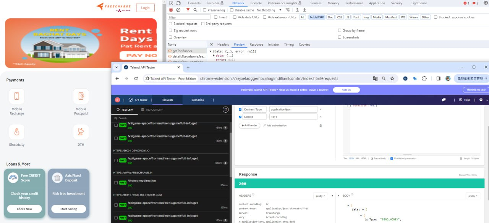
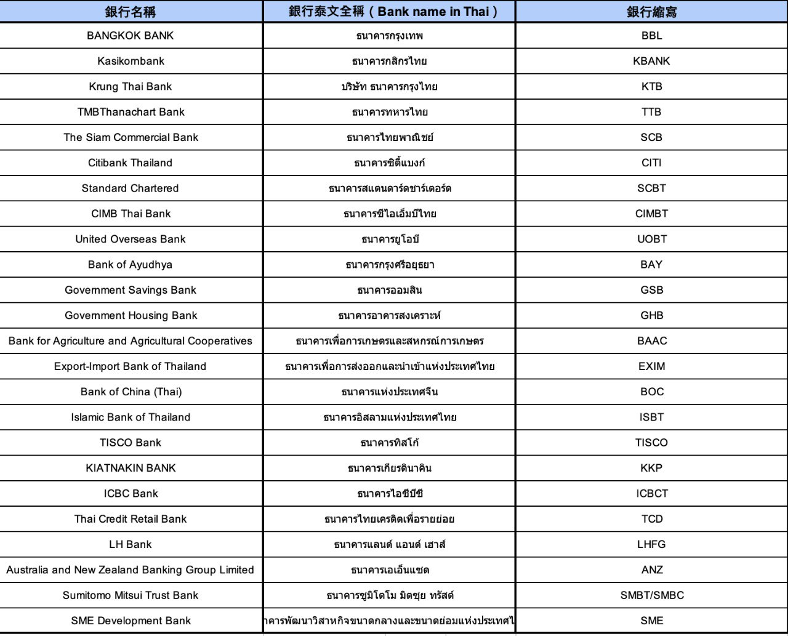
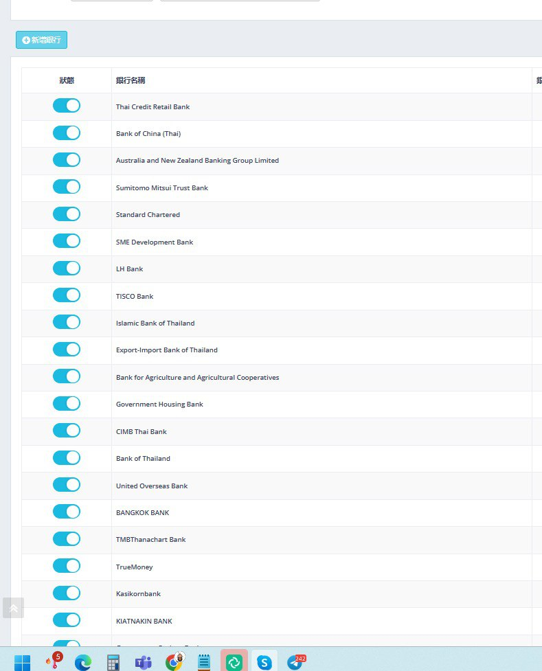
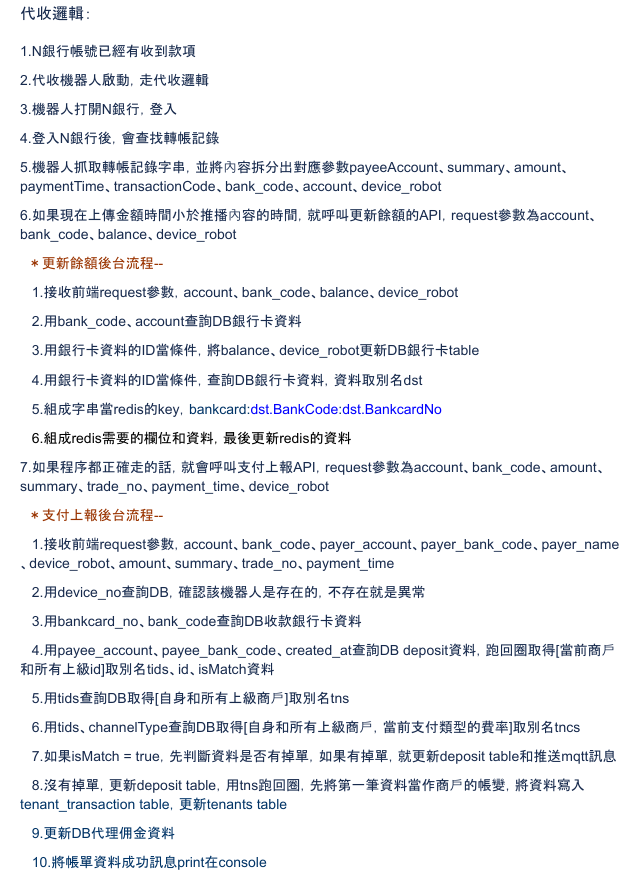
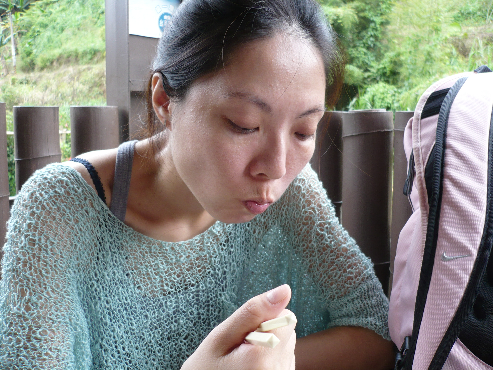
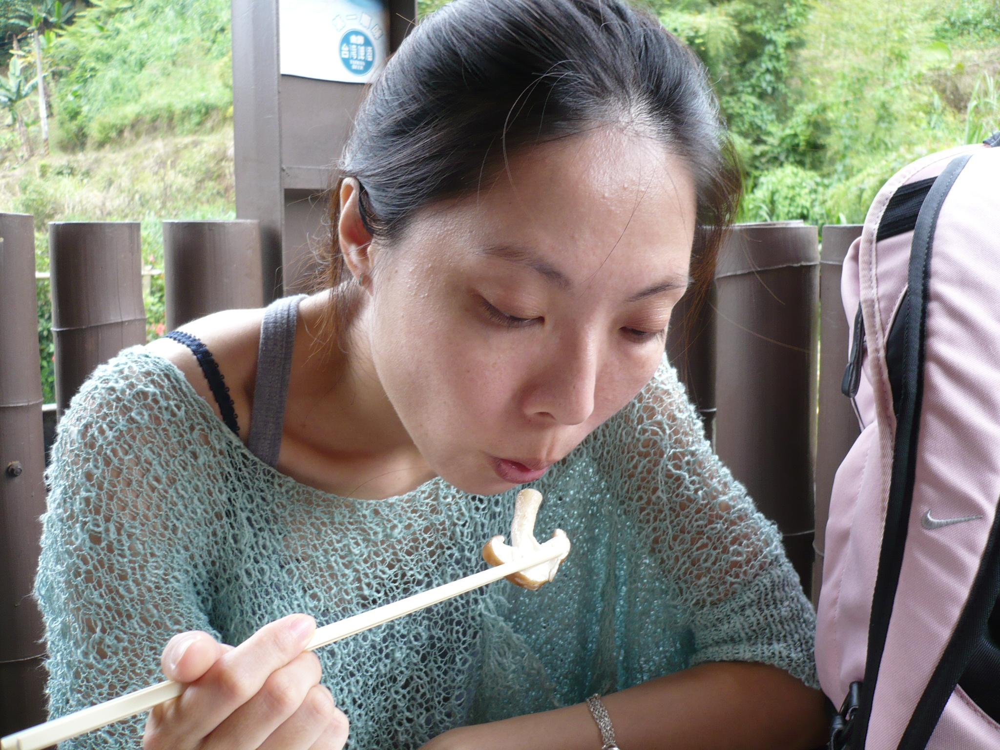

 
# AutoPayment

AutoPayment is an automation project designed to handle financial transaction records and fund transfers for different countries and regions.

The goal of this project is to help users quickly and accurately reconcile accounts and process daily financial transactions.

It supports multiple countries including India, Indonesia, Thailand, and Vietnam. 

The project leverages various technical methods and tools to automate the process, offering an efficient solution for financial transactions.

## Project Overview

Here is an overview image of the project:


## Project Structure

The directory structure of this project is as follows:

```
AutoPayment/
├── area/
│   ├
│   ├── India/           # 
│   ├── Indonesia/       # 印尼地區資料
│   ├── Thailand/        #   
│   └── Vietnam/         #   
├── technical_method/
│   ├── Accessibility/   # 可訪問性技術
│   ├── API/             # API 技術
│   ├── Autojs/          # Autojs 技術
│   ├── SMS/             # 短信技術
│   └── VirtualApp/      # 虛擬應用技術
├── tools/
│   ├── AutojsxPlugin/   # Autojsx 插件
│   ├── uiautomatorviewer/  # UIAutomatorViewer 工具
│   └── xposed/          # Xposed 插件
│       ├── DisableSecurityWindows/
│       ├── IAmNotADeveloper/
│       ├── IAmNotDisabled/
│       ├── ImNotADeveloperer/
│       └── virtual_camera/
└── README.md            # 專案文檔
```

## Features

The AutoPayment project is aimed at handling financial transaction records and fund transfers for various regions.

It includes different technical methods and tools to assist users in automating daily account reconciliation tasks, improving efficiency.

### Region Folders

The `area/` folder contains data for different regions, including:
- **India**: Financial transaction records for India
- **Indonesia**: Financial transaction records for Indonesia
- **Thailand**: Financial transaction records for Thailand
- **Vietnam**: Financial transaction records for Vietnam

These folders contain screenshots and finished work for each country, allowing users to review them.

### Technical Methods

The `technical_method/` folder includes various techniques used in the project:
- **Accessibility**: Using accessibility features for automation
- **API**: Integrating with other services via API
- **Autojs**: Automation scripts using Autojs
- **SMS**: SMS-based techniques
- **VirtualApp**: Techniques for virtual apps

### Tools

The `tools/` folder contains development tools and plugins to assist users in building and testing the automation system:
- **AutojsxPlugin**: Autojs plugin
- **uiautomatorviewer**: UIAutomatorViewer tool
- **xposed**: Various Xposed plugins, including:
  - **DisableSecurityWindows**
  - **IAmNotADeveloper**
  - **IAmNotDisabled**
  - **ImNotADeveloperer**
  - **virtual_camera**








